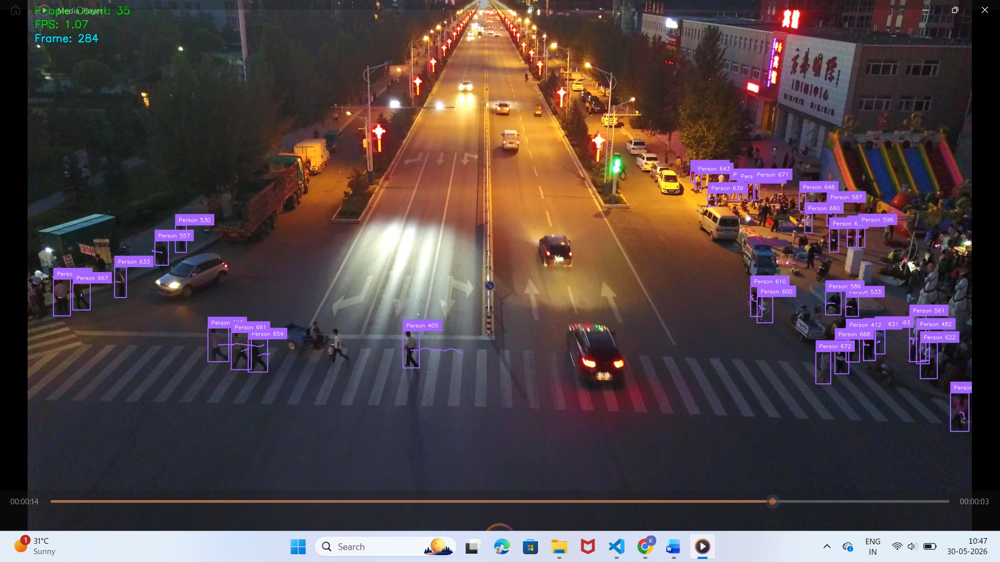
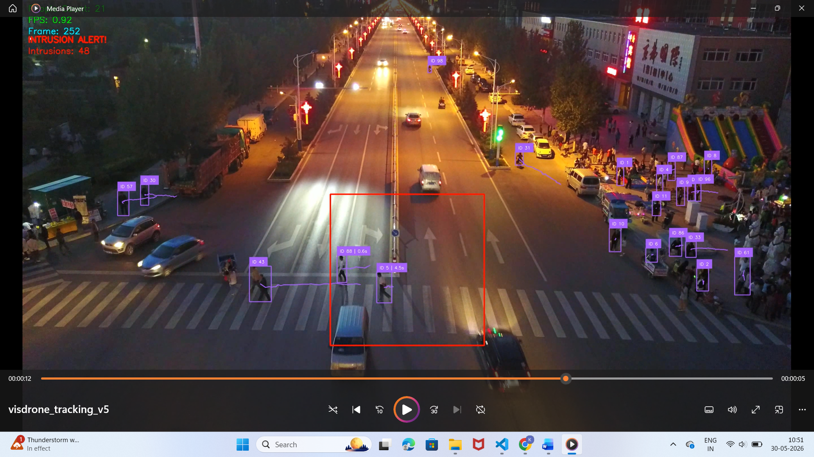
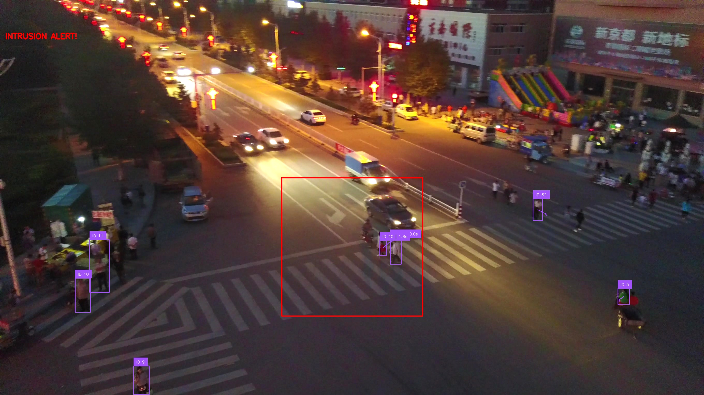
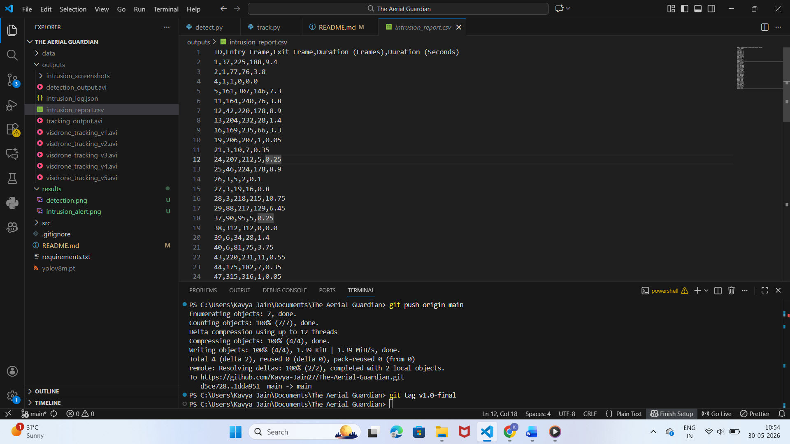

# The Aerial Guardian

Drone-based person detection and tracking system using YOLOv8 and ByteTrack.

## Project Overview

This project performs human detection, tracking and intrusion monitoring in drone surveillance footage.

The system uses YOLOv8 for person detection and ByteTrack for multi-object tracking. A restricted zone is defined within the surveillance area and whenever a person enters this zone, the system generates an intrusion alert, captures screenshots and stores event logs for analysis.

The project is developed using the VisDrone dataset.

## Features

- Human Detection using YOLOv8
- Multi-Object Tracking using ByteTrack
- Restricted Zone Intrusion Detection
- Unique Intruder ID Assignment
- Real-Time Intrusion Alerts
- Intrusion Screenshot Capture
- JSON Event Logging
- CSV Report Generation
- Intrusion Duration Measurement
- FPS Monitoring
- Tracking Trail Visualization

## Technologies Used

- Python
- YOLOv8
- ByteTrack
- OpenCV
- Supervision Library
- VisDrone Dataset

## System Architecture

```text
 Drone Video Frames
        ↓
 Image Enhancement
        ↓
 Tile-Based Processing
        ↓
 YOLOv8 Detection
        ↓
 ByteTrack Tracking
        ↓
 Intrusion Zone Analysis
        ↓
 Alert Generation
        ↓
 ┌─────────────┬─────────────┬─────────────┐                                  
Video Output  JSON Log    CSV Report   Intrusion Screenshots
```

## Installation

Clone the repository:

```bash
git clone https://github.com/Kavya-Jain27/The-Aerial-Guardian.git
cd The-Aerial-Guardian
```

Install dependencies:

```bash
pip install ultralytics supervision opencv-python numpy
```

## Run the Project

Place the VisDrone image sequence inside:

```text
data/uav0000117_02622_v
```

Run:

```bash
python main.py
```

## Results

The system successfully:

- Detects humans from drone imagery
- Tracks multiple people using unique IDs
- Identifies intrusions into restricted zones
- Generates intrusion alerts
- Captures intrusion screenshots
- Logs events in JSON format
- Creates CSV-based intrusion reports
- Measures intrusion duration inside the restricted area
- Monitors processing performance using FPS metrics

## Generated Outputs

- visdrone_tracking.avi
- intrusion_log.json
- intrusion_report.csv
- intrusion_screenshots/

## Sample Results

### Detection and Tracking



### Intrusion Alert



### Screenshot Capture



### Intrusion Report



## Future Scope

- Real-time UAV camera integration
- Multiple intrusion zones
- Email and SMS alert system
- Face recognition integration
- Edge deployment on drones
- Cloud-based monitoring dashboard